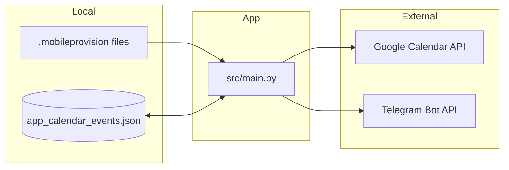

# Certificate Expiration Tracker

[](https://github.com/momonala/certificate-expiration/actions/workflows/ci.yml)
[](https://codecov.io/gh/momonala/certificate-expiration)

Monitors iOS provisioning profile expiration dates and sends notifications via Google Calendar and Telegram.

## Prerequisites

- Python 3.12+
- Xcode installed (provisioning profiles in `~/Library/Developer/Xcode/UserData/Provisioning Profiles/`)
- Google Cloud service account with Calendar API enabled
- Telegram bot token and chat ID

## Configuration

Non-secret settings live in `pyproject.toml`'s `[tool.config]` (view with `uv run config --all`); a few remaining constants are still hardcoded in source.

| Location | Setting | Description |
|----------|---------|-------------|
| `pyproject.toml` `[tool.config]` | `calendar_file` | Path to the event-ID tracking JSON |
| `pyproject.toml` `[tool.config]` | `google_creds_file` | Path to the GCP service account JSON |
| `src/main.py` | `PROVISIONING_PROFILES_DIR` | Path to provisioning profiles directory |
| `src/main.py` | `BERLIN_TZ` | Timezone for date display |
| `src/main.py` | `identifier` (in `extract_app_name`) | Provisioning profile name prefix to match |
| `src/gcal.py` | `CALENDAR_ID` | Google Calendar to add events to |
| `src/gcal.py` | `colorId` | Calendar event color (11 = red) |

## Installation

1. Clone the repository:
   ```bash
   git clone https://github.com/momonala/certificate-expiration.git
   cd certificate-expiration
   ```

2. Install dependencies:
   ```bash
   uv sync
   ```

3. Create `google_application_credentials.json` with your Google Cloud service account credentials:
   ```json
   {
     "type": "service_account",
     "project_id": "YOUR_PROJECT_ID",
     "private_key_id": "...",
     "private_key": "...",
     "client_email": "...@...iam.gserviceaccount.com",
     "client_id": "...",
     "auth_uri": "https://accounts.google.com/o/oauth2/auth",
     "token_uri": "https://oauth2.googleapis.com/token"
   }
   ```

4. Copy `src/values.py.example` to `src/values.py` and fill in your Telegram credentials:
   ```python
   telegram_api_token = "YOUR_BOT_TOKEN"
   telegram_chat_id = "YOUR_CHAT_ID"
   ```

5. Update `PROVISIONING_PROFILES_DIR`/`identifier` in `src/main.py` and `CALENDAR_ID` in `src/gcal.py` — see [Configuration](#configuration).

## Running

```bash
uv run cert-exp
```

Runs a check and creates/updates calendar events + sends Telegram notifications. `uv run cert-exp clear` removes all local Xcode provisioning profiles (useful to force Xcode to re-fetch fresh ones).

## Project Structure

```
certificate-expiration/
├── src/
│   ├── main.py                          # Entry point (typer CLI) - parses certs, sends notifications
│   ├── gcal.py                          # Google Calendar event creation/updates
│   ├── config.py                        # Exposes [tool.config] via `uv run config`
│   ├── values.py.example                # Stub Telegram credentials used in CI
│   └── values.py                        # Telegram credentials (not committed)
├── google_application_credentials.json  # GCP service account (not committed)
├── app_calendar_events.json             # Persisted mapping of app → calendar event ID
└── pyproject.toml                       # Project config and dependencies
```

## Architecture



## Key Concepts

| Concept | Description |
|---------|-------------|
| Provisioning Profile | `.mobileprovision` file containing iOS app signing certificate with expiration date |
| `XC mnalavadi` identifier | Prefix used in provisioning profiles to identify the app name |
| Event tracking | Maps app names to Google Calendar event IDs for updates vs creates |
| Day-before reminder | Calendar events are created for 1 day before actual expiration |

## Data Flow

1. **Parse** - Read `.mobileprovision` files from Xcode directory
2. **Extract** - Parse XML-like content to get app name and expiration date
3. **Filter** - Skip apps with "test" or "widget" in name
4. **Calendar** - Create/update Google Calendar event for day before expiration
5. **Notify** - Send Telegram message with expiration countdown

## Storage

| File | Purpose |
|------|---------|
| `app_calendar_events.json` | Maps app names to Google Calendar event IDs for idempotent updates |
| `google_application_credentials.json` | GCP service account credentials |
| `values.py` | Telegram bot token and chat ID |

## External API Dependencies

| Service | Auth Method | Notes |
|---------|-------------|-------|
| Google Calendar API | Service account JSON | Requires calendar sharing with service account email |
| Telegram Bot API | Bot token | Send messages to specific chat ID |
